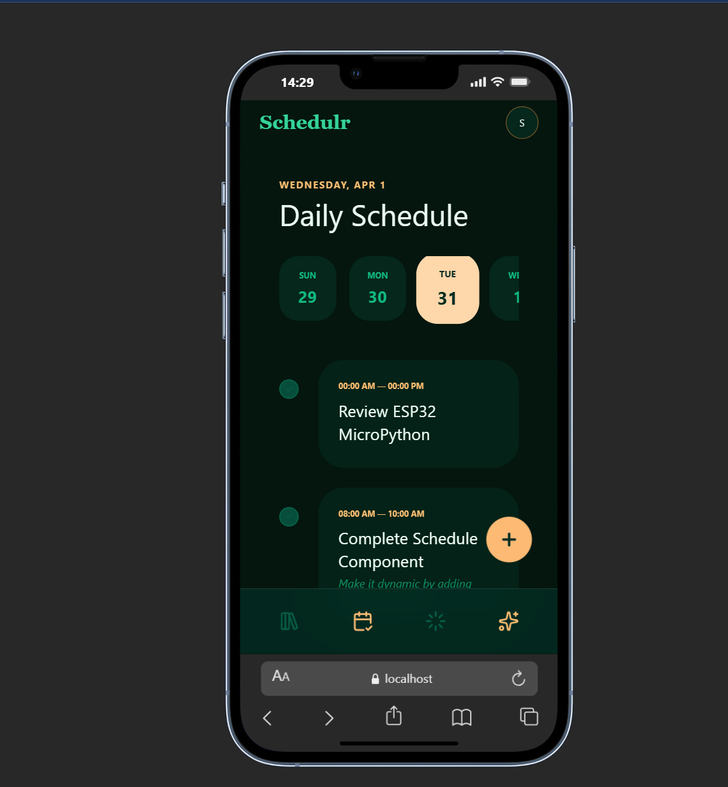
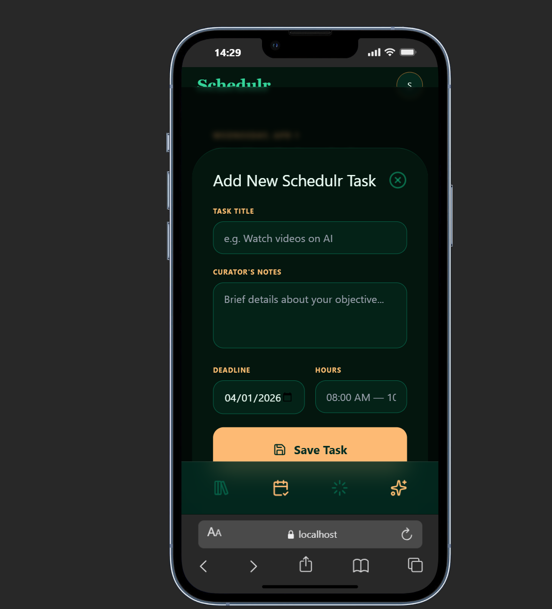

# 📅 Schedulr

Schedulr is an AI-powered study planner designed to help students organize their learning, manage deadlines, and generate smart study schedules.

---

##  Tech Stack

- **Frontend:** React (Vite), Tailwind CSS  
- **Backend:** Supabase  
- **Icons:** Lucide React  
- **Language:** JavaScript  

---

##  Goal

To build a smart study planner that:
- Helps students organize courses and topics  
- Generates AI-powered study schedules  
- Tracks progress over time  

---

## System Architecture & Component Logic

### 1. The Consistency Engine (Progress.jsx)

This component handles the heavy lifting of data analytics, transforming a simple list of tasks into actionable performance metrics.

#### Recursive Streak Algorithm
- Logic: Uses a custom hook useCurrentTask to fetch all completed tasks. It creates a Set of unique dates to ensure multiple tasks on the same day don't inflate the streak.
- Calculation: It performs a "look-back" check. If no task was finished today, it checks yesterday to maintain the streak. It then iterates backward through the timeline, incrementing the count until a gap in completion is found.

#### Focus Velocity Calculation
- Logic: Compares productivity levels across a 14-day window.
- Calculation: It filters tasks into "This Week" (days 0-7) and "Last Week" (days 8-14). It calculates the percentage change using:

$$
\text{Velocity} = \frac{\text{ThisWeek} - \text{LastWeek}}{\text{LastWeek}} \times 100
$$

#### Real-time Session Progress
- Logic: Dynamically calculates the percentage of the current active session using a setInterval that triggers every 30 seconds.
- Visual: Uses an SVG strokeDasharray animation that maps the time-elapsed ratio to the circumference of the circle.

---

### 2. Daily Schedule & Task Orchestration (Schedule.jsx)

The "Curator" of the app, allowing for complex time management and database synchronization.

#### Temporal Navigation
- Features a horizontally scrolling date picker that updates the global selectedDate state, triggering a targeted Supabase query for that specific 24-hour window.

#### CRUD Operations
- Create/Update: A unified modal handles both adding and editing tasks. It calculates total_minutes on the fly by converting time strings into ISO-8601 timestamps.
- Management: Implements an Ellipsis action menu for granular control (Edit/Delete), maintaining a clean UI while providing full task management capabilities.

#### Dynamic UI Indicators
- Automatically identifies the "Current" task by comparing the user's local time against the task's start_time and end_time range, adding a high-visibility pulse animation to the active item.

---

### 3. The Vault: Interactive Execution (Dashboard.jsx)

The primary interface for user productivity and task fulfillment.

#### Optimistic UI Updates
- When a user "crosses out" a task, the component immediately updates the local state for a lag-free experience before syncing the change to the Supabase backend.

#### Data Integrity
- Toggling a task as "done" serves as the primary data trigger for the Streak Engine. This ensures that the streak is an honest reflection of completed work rather than just scheduled time.

#### The "Vault" Concept
- Uses a specialized "Scholar" theme, treating tasks as "Manuscripts" to be completed, aligning with the app's aesthetic of academic excellence.

---

## Schedulr Login System

### 1. Email & Password Login
- Connected the login form to Supabase using `supabase.auth.signInWithPassword()`
- Added controlled inputs with React state for email and password
- Added a red error message box that shows Supabase error messages
- Added a loading state ("VERIFYING...") on the submit button

### 2. Facial Recognition Registration
- Integrated face-api.js for in-browser AI face detection
- Downloaded and set up 6 model files from vladmandic/face-api into `/public/models/`:
  - tiny_face_detector_model-weights_manifest.json
  - tiny_face_detector_model.bin
  - face_landmark_68_model-weights_manifest.json
  - face_landmark_68_model.bin
  - face_recognition_model-weights_manifest.json
  - face_recognition_model.bin
- Configured models to load on mount using `import.meta.env.BASE_URL`
- Camera opens, warms up for 2 seconds, then attempts detection up to 8 times
- On success, saves the face descriptor (128-float array) to Supabase `profiles` table as `jsonb`

### 3. Facial Recognition Login
- Added a Login / Register toggle below the face scan button
- In Login mode: captures live face, fetches stored descriptor from Supabase, compares using `faceapi.euclideanDistance()` — match threshold is 0.6
- Fixed a bug where the parameter `liveDescriptor` was referenced instead of `descriptor`

### 4. Supabase Database
- Used the `profiles` table with columns: `id`, `email`, `face_descriptor (jsonb)`, `created_at`, linked to `auth.users.id`
- Switched from `.update()` to `.upsert()` to fix a 406 error (row not found)
- Re-enabled Row Level Security (RLS) on both `profiles` and `tasks` tables with proper policies

### 5. Logout
- Added a dropdown menu to the "S" avatar button in the header in `Layout.jsx`
- Dropdown contains "Profile" and a red "Sign Out" button
- Sign Out calls `supabase.auth.signOut()` and redirects to `/login`
- Clicking outside the dropdown closes it

### Technical Engineering
Backend Orchestration: Managed real-time data synchronization and complex filtering with Supabase (PostgreSQL).

Algorithmic Data Handling: Developed custom logic for calculating rolling focus velocity and consecutive day streaks.

Custom React Architecture: Engineered a modular system using Custom Hooks (useCurrentTask) to decouple business logic from the UI layer.

Modern UI/UX: Implemented a "Scholar-themed" interface using Tailwind CSS, featuring glassmorphism, pulse animations, and responsive design.

---

## Screenshots of layout showing dashboard

---

## Screenshots of layout showing Schedule

## Screenshots of Login page

## 📌 Status

🚧 Work in progress — actively building and improving
